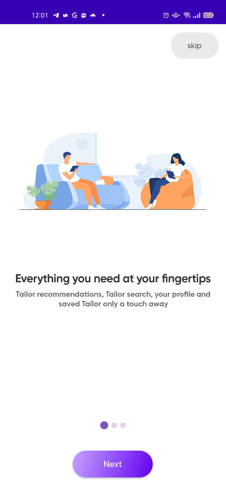
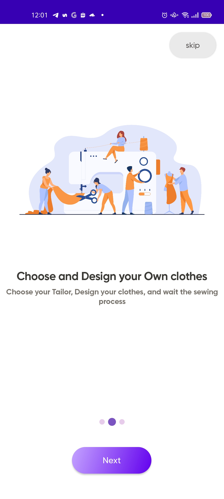
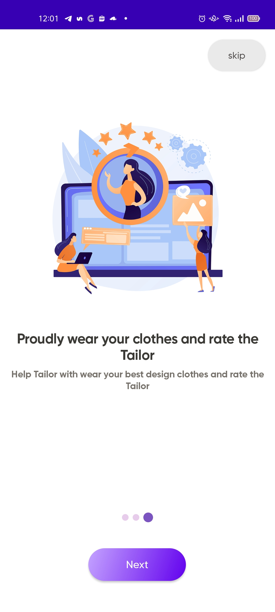
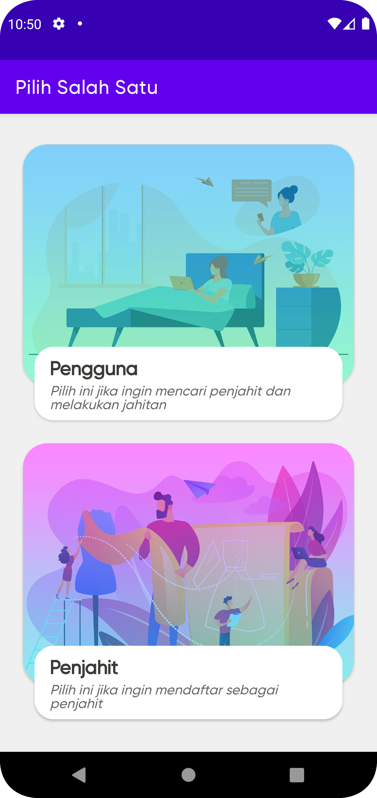
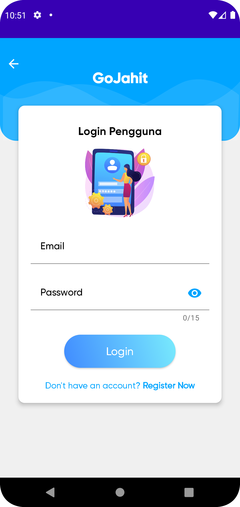
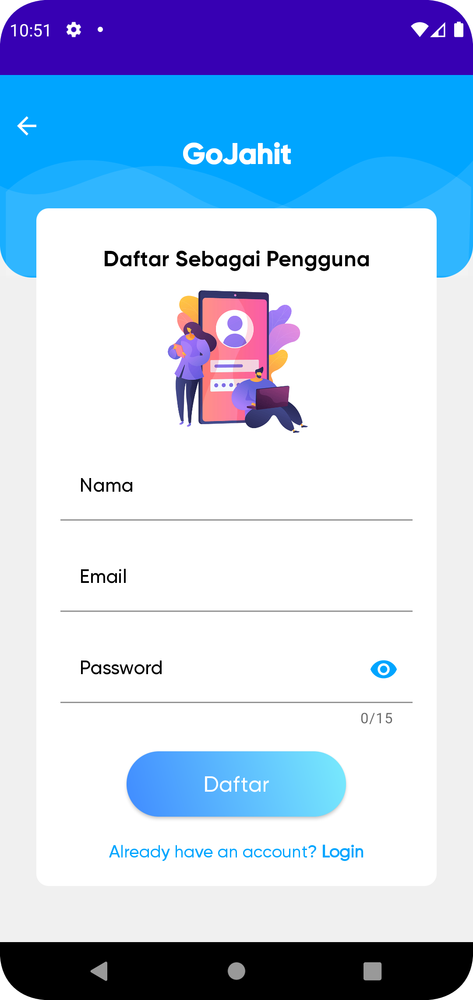

## GoTukang Client - Aplikasi Pencari Tukang

## About This Project
Aplikasi Pencari Tukang Berbasis Android Menggunakan Teknologi Location Based Services dan Metode SMART. Teknologi Location Based Services (LBS) digunakan untuk penentuan lokasi, sedangkan metode SMART digunakan untuk perangkingan Tukang.

Dalam menentukan kriteria, saya menggunakan data dari penelitian sebelumnya milik sdr Susandri dan rekan-rekannya pada tahun 2020 mengenai Aplikasi Jasa Jahit Pakaian Berbasis Mobile dengan Teknologi Location Based Services dan Metode SMART dalam menentukan kriteria yang dibutuhkan untuk diimplementasikan ke dalam sistem.
Berikut kriteria yang dipilih:
1. Kriteria kualitas pekerjaan.
   Pada kriteria kualitas pekerjaan diambil berdasarkan penilaian mengenai kepuasan hasil TUKANG yang dilakukan oleh Tukang.
2. Kriteria lama waktu pengerjaan.
   Pada kriteria lama waktu pengerjaan diambil berdasarkan penilaian kecepatan dan ketepatan waktu Tukang dalam menyelesaikan TUKANG.
3. Kriteria layanan Tukang.
   Pada kriteria layanan Tukang diambil berdasarkan penilaian mengenai keramahan dan respon Tukang pada saat terjadinya pemesanan hingga pengerjaan selesai.
4. Kriteria harga jasa tukang.
   Pada kriteria layanan Tukang diambil berdasarkan penilaian mengenai kecocokan harga dengan hasil yang diberikan. 
   
Dalam menentukan bobot kriteria dan parameter untuk setiap kriteria dengan memberikan bobot kriteria pada masing-masing kriteria dengan menggunakan interval 1-100 untuk masing-masing kriteria dengan prioritas terpenting. 
Setiap kriteria dibagi dalam tiga parameter yang berbeda, diantaranya yaitu:
1. Kualitas Pekerjaan : 1 buruk, 2 cukup, 3 baik.
2. Lama Waktu Pengerjaan : 1 tidak tepat, 2 tepat waktu, 3 lebih awal.
3. Layanan Tukang : 1 tidak suka, 2 suka, 3 sangat suka.
4. Harga Jasa Tukang : 1 tinggi, 2 sedang, 3 rendah.

## Version Release

This Is Latest Release

    ~ Beta Release
    $version_release = 1.0.0

## Test Case Project

- Website Admin Scenario Test [Click Here]()
- Android Apps Scenario Test [Click Here]()
- Report All Test [Click Here]()
- Android Apps Result Test [Click Here]()
- Website Admin Result Test [Click Here]()

## Documentation

### Research Data

- Image and Asset [Click Here]()
- Sheet Feedback [Click Here]()
- Diagram on Draw Io [Click Here]()

### Final Task (Skipsi)

- Download the application [here](https://drive.google.com/drive/folders/1bp0LWzJ0XXViDGqM-BnUzkKF_stwFPIi).
- Watch the demo video of the GoJahit application [here](https://www.youtube.com/watch?v=LMil55RY9Ho).
- Watch the demo video of the GoJahit Server - website admin [here](https://www.youtube.com/watch?v=okxcWtx5dZU&t=5s).
- Visit the website admin [here]()
- Documentation of the GoJahit Client Application [here]()
- Documentation of the GoJahit Server [here]()

## Informatics Lecturers

- Ibu Retno Mumpuni, S.Kom, M.Sc. (NPT. 172198 70 716054) - retnomumpuni.if@upnjatim.ac.id
- Bapak Hendra Maulana, S.Kom, M.Kom. (NPT. 201198 31 223248) - hendra.maulana.if@upnjatim.ac.id

## Architecture

-   Pattern  [Model-View-ViewModel](https://en.wikipedia.org/wiki/Model%E2%80%93view%E2%80%93viewmodel)  (MVVM) facilitating a [separation](https://en.wikipedia.org/wiki/Separation_of_concerns) of development of the graphical user interface.

## Tech-stack

Min API level is set to 21, so the presented approach is suitable for over 94% of devices running Android. This project takes advantage of many popular libraries and tools of the Android ecosystem. Most of the libraries are in the stable version unless there is a good reason to use non-stable dependency.
-   [Jetpack](https://developer.android.com/jetpack):
-   [Android KTX](https://developer.android.com/kotlin/ktx.html)  - provide concise, idiomatic Kotlin to Jetpack and Android platform APIs.
-   [AndroidX](https://developer.android.com/jetpack/androidx)  - major improvement to the original Android  [Support Library](https://developer.android.com/topic/libraries/support-library/index), which is no longer maintained.
-   [View Binding](https://developer.android.com/topic/libraries/view-binding)  - allows you to more easily write code that interacts with views.
-   [Lifecycle](https://developer.android.com/topic/libraries/architecture/lifecycle)  - perform actions in response to a change in the lifecycle status of another component, such as activities and fragments.
-   [LiveData](https://developer.android.com/topic/libraries/architecture/livedata)  - lifecycle-aware, meaning it respects the lifecycle of other app components, such as activities, fragments, or services.
-   [Navigation](https://developer.android.com/guide/navigation/)  - helps you implement navigation, from simple button clicks to more complex patterns, such as app bars and the navigation drawer.
-   [ViewModel](https://developer.android.com/topic/libraries/architecture/viewmodel)  - designed to store and manage UI-related data in a lifecycle conscious way. The ViewModel class allows data to survive configuration changes such as screen rotations.
-   [Dagger2](https://dagger.dev/)  - dependency injector for replacement all Factory classes.
-   [Retrofit2](https://square.github.io/retrofit/)  - type-safe HTTP client.
-   [Glide](https://github.com/bumptech/glide)  - image loading and caching library.

## Diagram

### Use Case Diagram

### Activity Diagram

### Sequence Diagram

## REST API Documentation

## Screenshot Application

| Splash Screen | Landing Page (1) | Landing Page (2) | Landing Page (3) |
|:-------------:|:----------------:|:----------------:|:----------------:|
| |  |  |  |

| Memilih User | Login Pengguna | Register Pengguna |                               Login Tukang                               |                               Register Tukang                               |
|:------------:|:--------------:|:-----------------:|:------------------------------------------------------------------------:|:---------------------------------------------------------------------------:|
| |  |  |  |  |

## Thank you Note

Alhamdulillah wa syukurillah. Puji Syukur kepada [Allah Subhaanahu wa ta’aalaa]() yang telah memberikan
rahmat, hidayah, dan pertolongan-Nya. Karena hanya dengan ridho-Nya
saya mampu berfikir dan menyelesaikan skripsi ini.
Banyak dukungan dan bantuan yang didapatkan selama penelitian hingga
akhirnya mampu menyelesaikan skripsi dan studi ini. Dengan rasa hormat,
ucapan terima kasih kepada seluruh pihak terkait yang turut membantu dan
terlibat dalam menyelesaikan skripsi ini, jazakumullahu khairan katsiran.
Saya menyadari masih banyak kekurangan mengingat keterbatasan
pengetahuan dan kemampuan. Oleh karena itu saya menerima segala
kritik dan saran dari semua pihak dalam penyempurnaan skripsi ini.

Dengan izin dan ridho [Allah Subhaanahu wa ta’aalaa]() penelitian dan
studi ini berhasil terselesaikan. Selain itu, dengan segala hormat, ucapan terima
kasih yang sebesar–besarnya saya ucapkan kepada seluruh pihak terkait yang telah
membantu atas selesainya skripsi ini. Tanpa bantuan dan dukungan mereka,
skripsi ini tidak akan terselesaikan dengan baik. Ucapan terima kasih penulis
ucapkan kepada:

- Keluarga, terutama orang tua, kakak, dan adik-adik yang telah memberikan bantuan, doa, dukungan, hiburan, kasih, dan sayang selama ini.
- Ibu Retno dan Bapak Hendra sebagai Dosen Pembimbing.
- Seluruh Bapak dan Ibu Dosen Program Studi Informatika UPN “Veteran” Jawa Timur yang telah mendidik dan memberikan ilmunya.
- Teman seperjuangan yang ada dimanapun yang selalu mendoakan, mengingatkan, menghibur, dan menyemangati dalam pengerjaan skripsi ini.
- Tim Work yang telah menjadi rekan, dan sering memberikan bantuan dan kerjasamanya selama kuliah.
- Teman-teman Informatika angkatan 2017 dan kakak maupun adik tingkat serta pihak-pihak lain yang terkait yang tidak disebutkan atas segala bentuk kepeduliannya.

## Special thanks to

## Colaborator

Very open to anyone, I'll write your name under this, please contribute by sending an email to me

- Mail to karyadisimamora1@gmail.com
- Subject : Github _ [Github-Username-Account] _ [Language] _ [Repository-Name]

Name of Contributor
- Waiting List

Waiting for your contribution

## Copyright

- Majoring of Informatics
- Faculty of Computer Science
- UNIKOM

## Adding Information

- Hope this project can help, and thankyou for the support.
- Please enjoy, and you can support with fork or give a star.
- Feel free to follow my github account [ksmora](https://github.com/ksmora).

## MAD Scorecard Result

